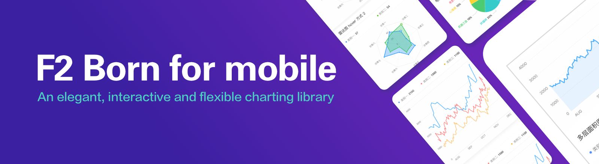
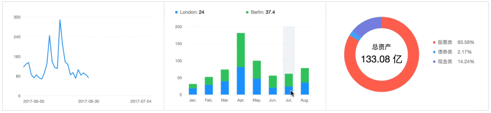
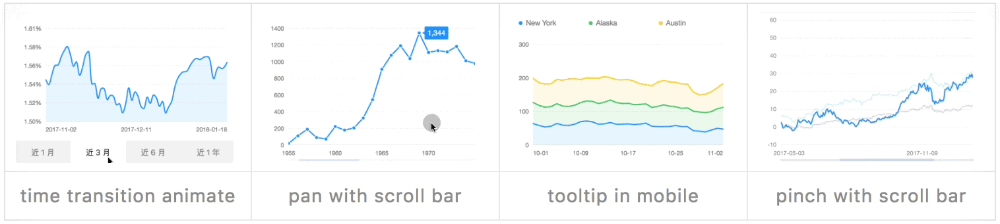

# F2



[](https://travis-ci.org/antvis/f2) [](https://camo.githubusercontent.com/0ad0e5d96d4eeb7cd28131b7e45b1ce63e77166c/68747470733a2f2f696d672e736869656c64732e696f2f62616467652f6c616e67756167652d6a6176617363726970742d7265642e737667) [](https://camo.githubusercontent.com/847d6888b6a4e56fc67888f74871a0f70228997f/68747470733a2f2f696d672e736869656c64732e696f2f62616467652f6c6963656e73652d4d49542d3030303030302e737667) [](https://www.npmjs.com/package/@antv/f2) [](https://npmjs.org/package/@antv/f2) [](http://isitmaintained.com/project/antvis/f2)

[](https://twitter.com/intent/tweet?text=F2,%20an%20elegant,%20interactive%20and%20flexible%20charting%20library%20for%20mobile.&url=https://antv.alipay.com/zh-cn/f2/3.x/index.html&hashtags=javascript,mobile,charts,dataviz,visualizations,F2)

[中文 README](https://github.com/antvis/f2/blob/master/README.zh-CN.md)

F2 is **born for mobile**, developed for developers as well as designers. It is Html5 Canvas-based, and is also compatible with Node.js, Weex and React Native. Based on [the grammar of graphics](https://www.cs.uic.edu/~wilkinson/TheGrammarOfGraphics/GOG.html), F2 provides all the chart types you'll need. Our mobile design guidelines enable better user experience in mobile visualzation projects


> Special thanks to [Leland Wilkinson](https://en.wikipedia.org/wiki/Leland_Wilkinson), the author of [_The Grammar Of Graphics_](https://www.cs.uic.edu/~wilkinson/TheGrammarOfGraphics/GOG.html), whose book served as the foundation for F2 and G2.

## Installation

```bash
$ npm install @antv/f2
```

## Features

### Born for mobile

* **Design for mobile**: make data more alive and chart interactions more natural.





* **Performance**: small package size\(version without interaction is 44k after gzip\) with great rendering performance.
* **Compatibility**: multi-end, Multi-runtime support. Besides H5 env, F2 can also run in [Node.js](https://antv.gitbook.io/f2/platform), [Weex rendering](https://github.com/weex-plugins/weex-chart) and [React Native](https://github.com/chenshuai2144/f2-demo), also [支付宝小程序](https://github.com/antvis/my-f2) and [微信小程序](https://github.com/antvis/wx-f2)


### All the chart types you want

With the power of grammar of graphics, F2 supports data-driven [50+ chart types](https://antv.alipay.com/zh-cn/f2/3.x/demo/index.html)\(the amount can be even more, which is depended on you\) including classical charts such as line, column/bar chart, pie chart, scatter plot, gauges, etc. Additionally, F2 also provides feature-riched chart components, such as Tooltip, Legend and Guide.

### Flexible and Interactive

We also provide developers with flexible extension mechanisms, including shape, animation, and interactive customization capabilities, as well as flexible styling to meet a variety of personalized charting requirements.

[](https://user-images.githubusercontent.com/6628666/44565579-6c16c080-a79b-11e8-9494-86f3ad477341.gif)[](https://user-images.githubusercontent.com/6628666/44565581-6c16c080-a79b-11e8-8210-f4e797480e87.gif)[](https://user-images.githubusercontent.com/6628666/44565580-6c16c080-a79b-11e8-956d-4d15455468a3.gif)[](https://user-images.githubusercontent.com/6628666/44565583-6caf5700-a79b-11e8-8e9e-a1fa12ddcbf1.gif)

## Links

* [Website](https://antv.alipay.com/zh-cn/f2/3.x/index.html)
* English documents: [https://antv.gitbook.io/f2/](https://antv.gitbook.io/f2/)
* 中文文档: [https://antv.alipay.com/zh-cn/f2/3.x/api/index.html](https://antv.alipay.com/zh-cn/f2/3.x/api/index.html)

## Other libraries base on F2

* [ant-design-mobile-chart](https://github.com/ant-design/ant-design-mobile-chart): Ant Design Mobile Chart based on F2. \(React\).
* [BizGoblin](https://github.com/alibaba/BizGoblin)：Data visualization library based F2 and React.
* [VChart](https://doc.vux.li/zh-CN/components/v-chart.html): Mobile Chart Components based on vux and F2. \(Vue\).
* [weex-chart](https://github.com/weex-plugins/weex-chart): Chart components based on Weex and F2.

## Demos

[Chart Demos](https://antv.alipay.com/zh-cn/f2/3.x/demo/index.html)

**Or just scan the below qrcode to see demos in mobile:**

[](https://camo.githubusercontent.com/d10b66ebd9e3514b107c99346e834ac71d5ce5a2/68747470733a2f2f67772e616c697061796f626a656374732e636f6d2f7a6f732f726d73706f7274616c2f6e7a6c78497a55426c425256474d79615a6967472e706e67)

## Getting Started

[](https://camo.githubusercontent.com/17c2e194f0df8a7a1f4d8035041bc0339e74b609/68747470733a2f2f67772e616c697061796f626a656374732e636f6d2f7a6f732f726d73706f7274616c2f4e6874666d6f4b4f496e6e4859726457546671682e706e67)

```markup
<canvas id="mountNode"></canvas>
```

```javascript
import F2 from '@antv/f2';

const data = [
  { year: '1951', sales: 38 },
  { year: '1952', sales: 52 },
  { year: '1956', sales: 61 },
  { year: '1957', sales: 145 },
  { year: '1958', sales: 48 },
  { year: '1959', sales: 38 },
  { year: '1960', sales: 38 },
  { year: '1962', sales: 38 },
];
const chart = new F2.Chart({
  id: 'mountNode',
  width: 375,
  height: 265,
  pixelRatio: window.devicePixelRatio
});
chart.source(data);
chart.interval().position('year*sales');
chart.render();
```

## Development

```bash
$ npm install

# run test case
$ npm run test-live

# build watching file changes and run demos
$ npm run dev

# run demos
$ npm run demos

# run pack
$ npm run bundler
```

## How to Contribute

Please let us know how can we help. Do check out [issues](https://github.com/antvis/f2/issues) for bug reports or suggestions first.

To become a contributor, please follow our [contributing guide](https://github.com/antvis/f2/blob/master/CONTRIBUTING.md).

## License

[MIT licens](https://github.com/antvis/f2/blob/master/LICENSE)

