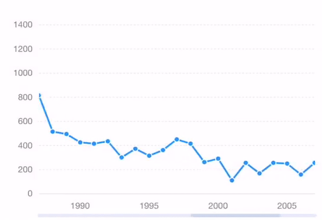

# Pan



Based on `pan`  gesture\( from [Hammer.js](http://hammerjs.github.io/recognizer-pan/)\), it also provides `press`  gesture to trigger the interaction of the tooltip.

### How to use

```javascript
const F2 = require('@antv/f2/lib/index'); // require F2
require('@antv/f2/lib/interaction/pan'); // require the interaction

// ... create a chart instance

// call the interaction, should be call before chart.render()
chart.interaction('pan');
```

### Configuration options <a id="configuration-options"></a>

```javascript
chart.interaction('pan', {
  mode: {String}, 
  panThreshold: {Number}, 
  pressThreshold: {Number},
  pressTime: {Number},
  limitRange: {Object},
  onStart: {Function},
  onProcess: {Function},
  onEnd: {Function}
});
```

<table>
  <thead>
    <tr>
      <th style="text-align:left">Name</th>
      <th style="text-align:left">Type</th>
      <th style="text-align:left">Default</th>
      <th style="text-align:left">Description</th>
    </tr>
  </thead>
  <tbody>
    <tr>
      <td style="text-align:left"><code>mode</code>
      </td>
      <td style="text-align:left">String</td>
      <td style="text-align:left">'x'</td>
      <td style="text-align:left">The direction of pan, can be 'x', 'y' or 'xy'. The default value is 'x'.</td>
    </tr>
    <tr>
      <td style="text-align:left"><code>panThreshold</code>
      </td>
      <td style="text-align:left">Number</td>
      <td style="text-align:left">10</td>
      <td style="text-align:left">Minimal pan distance required before recognizing.</td>
    </tr>
    <tr>
      <td style="text-align:left"><code>pressThreshold</code>
      </td>
      <td style="text-align:left">Number</td>
      <td style="text-align:left">9</td>
      <td style="text-align:left">Minimal movement that is allowed while pressing. press will trigger tooltip.</td>
    </tr>
    <tr>
      <td style="text-align:left"><code>pressTime</code>
      </td>
      <td style="text-align:left">Number</td>
      <td style="text-align:left">251</td>
      <td style="text-align:left">Minimal press time in ms.</td>
    </tr>
    <tr>
      <td style="text-align:left"><code>limitRange</code>
      </td>
      <td style="text-align:left">Object</td>
      <td style="text-align:left">Automatic calculation based on the range of data</td>
      <td style="text-align:left">
        <p>The maximum and minimum range used to set the chart, needs to correspond
          to the data field corresponding to the x or y axis. Use the following:</p>
        <p><code>limitRange: { </code>
        </p>
        <p><code>    fieldA: { </code>
        </p>
        <p><code>        min: 0, </code>
        </p>
        <p><code>        max: 100 </code>
        </p>
        <p><code>    } </code>
        </p>
        <p><code>}  </code>
        </p>
      </td>
    </tr>
    <tr>
      <td style="text-align:left"><code>onStart</code>
      </td>
      <td style="text-align:left">Function</td>
      <td style="text-align:left">null</td>
      <td style="text-align:left">The callback after the start event is triggered.</td>
    </tr>
    <tr>
      <td style="text-align:left"><code>onPress</code>
      </td>
      <td style="text-align:left">Function</td>
      <td style="text-align:left">null</td>
      <td style="text-align:left">The callback after the process event is triggered.</td>
    </tr>
    <tr>
      <td style="text-align:left"><code>onEnd</code>
      </td>
      <td style="text-align:left">Function</td>
      <td style="text-align:left">null</td>
      <td style="text-align:left">The callback after the end event is triggered.</td>
    </tr>
  </tbody>
</table>### Demo

* [pan for line chart](https://antv.alipay.com/zh-cn/f2/3.x/demo/interaction/pan-for-line-chart.html)
* [pan for bar chart](https://antv.alipay.com/zh-cn/f2/3.x/demo/interaction/pan-for-bar-chart.html)
* [pinch and pan for scatter chart](https://antv.alipay.com/zh-cn/f2/3.x/demo/interaction/pinch-and-pan-for-scatter-chart.html)


