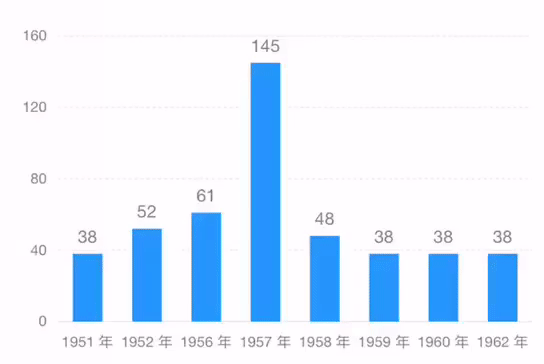

# Selection for Bar Chart



### How to use

```javascript
const F2 = require('@antv/f2/lib/index'); // require F2
require('@antv/f2/lib/interaction/interval-select'); // require the interaction

// ... create a chart instance

// call the interaction
chart.interaction('interval-select');
```

### Configuration options {#configuration-options}

```javascript
chart.interaction('interval-select', {
  startEvent: {String},
  selectStyle: {Object},
  unSelectStyle: {Object},
  selectAxis: {Boolean},
  selectAxisStyle: {Object},
  cancelable: {Boolean},
  onStart: {Function}, 
  onEnd: {Function}, 
  mode: {String},
  defaultSelected: {Object}
});
```

<table>
  <thead>
    <tr>
      <th style="text-align:left">Name</th>
      <th style="text-align:left">Type</th>
      <th style="text-align:left">Default</th>
      <th style="text-align:left">Description</th>
    </tr>
  </thead>
  <tbody>
    <tr>
      <td style="text-align:left"><code>startEvent</code>
      </td>
      <td style="text-align:left">String</td>
      <td style="text-align:left">'tap'</td>
      <td style="text-align:left">This interaction is triggered by touch or touch gesture. Optional 'touchstart'
        or 'tap'.</td>
    </tr>
    <tr>
      <td style="text-align:left"><code>selectStyle</code>
      </td>
      <td style="text-align:left">Object</td>
      <td style="text-align:left"><code>{ fillOpacity: 1 }</code>
      </td>
      <td style="text-align:left">Set the display style of the selected bar.</td>
    </tr>
    <tr>
      <td style="text-align:left"><code>unSelectStyle</code>
      </td>
      <td style="text-align:left">Object</td>
      <td style="text-align:left"><code>{ fillOpacity: 0.4 }</code>
      </td>
      <td style="text-align:left">Set the display style of the unselected bar. If you don't need to set
        it, you can set it to <code>null</code> directly.</td>
    </tr>
    <tr>
      <td style="text-align:left"><code>selectAxis</code>
      </td>
      <td style="text-align:left">Boolean</td>
      <td style="text-align:left">true</td>
      <td style="text-align:left">Whether to highlight the axis label, the default is <code>true</code>.
        If not needed, you can choose to turn it off: <code>selectAxis: false</code>.</td>
    </tr>
    <tr>
      <td style="text-align:left"><code>selectAxisStyle</code>
      </td>
      <td style="text-align:left">Object</td>
      <td style="text-align:left"><code>{ fontWeight: &apos;bold&apos; }</code>
      </td>
      <td style="text-align:left">Set the style for axis label which its bar is selected. Only works if <code>selectAxis</code> is
        true.</td>
    </tr>
    <tr>
      <td style="text-align:left"><code>cancelable</code>
      </td>
      <td style="text-align:left">Boolean</td>
      <td style="text-align:left">true</td>
      <td style="text-align:left">After the shape is selected, click again to allow unchecked. The default
        is true, indicating that it will be unchecked.</td>
    </tr>
    <tr>
      <td style="text-align:left"><code>onStart</code>
      </td>
      <td style="text-align:left">Function</td>
      <td style="text-align:left">null</td>
      <td style="text-align:left">The callback after the start event is triggered.</td>
    </tr>
    <tr>
      <td style="text-align:left"><code>onEnd</code>
      </td>
      <td style="text-align:left">Function</td>
      <td style="text-align:left">null</td>
      <td style="text-align:left">The callback after the end event is triggered.</td>
    </tr>
    <tr>
      <td style="text-align:left"><code>mode</code>
      </td>
      <td style="text-align:left">String</td>
      <td style="text-align:left">'shape'</td>
      <td style="text-align:left">The default is 'shape', that is, hitting the bar will trigger the interaction.
        Another optional value is 'range', which means that the selected interaction
        is triggered as long as the concentration point falls within a certain
        x-direction range of the bar.</td>
    </tr>
    <tr>
      <td style="text-align:left"><code>defaultSelected</code>
      </td>
      <td style="text-align:left">Object</td>
      <td style="text-align:left">null</td>
      <td style="text-align:left">
        <p>If you want shape to be selected when chart inited, you can pass in the
          shape value to <code>defaultSelected</code>.</p>
        <p><b>If you need to use this property, please call the method after the <code>chart.render() </code>. </b>
        </p>
      </td>
    </tr>
  </tbody>
</table>#### `onStart` callback

```javascript
/**
 * @param {Object} ev
 */ 
onStart(ev) {
  // ev.data: Object, dataset of the selected shape
  // ev.shapeInfo: Object, information of the selected shape
  // ev.shape: Shape, the selected shape
  // ev.selected: the status of the current shape
  const { data, shapeInfo, shape, selected } = ev;
}
```

#### `onEnd` callback {#onend-callback}

```javascript
/**
 * @param {Object} ev
 */ 
onEnd(ev) {
  // ev.data: Object, dataset of the selected shape
  // ev.shapeInfo: Object, information of the selected shape
  // ev.shape: Shape, the selected shape
  // ev.selected: the status of the current shape
  const { data, shapeInfo, shape, selected } = ev;
}
```

### Demo

[https://antv.alipay.com/zh-cn/f2/3.x/demo/interaction/selection-for-bar-chart.html](https://antv.alipay.com/zh-cn/f2/3.x/demo/interaction/selection-for-bar-chart.html)

