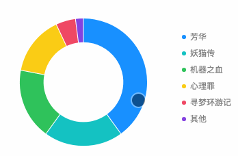

# Selection for Pie Chart



### How to use

```javascript
const F2 = require('@antv/f2/lib/index'); // require F2
require('@antv/f2/lib/interaction/pie-select'); // require the interaction

// ... create a chart instance

// call the interaction
chart.interaction('pie-select');
```

### Configuration options {#configuration-options}

```javascript
chart.interaction('pie-select', {
  startEvent: {String},
  animate: {Boolean} / {Object},
  offset: {Number},
  appendRadius: {Number},
  style: {Object},
  cancelable: {Boolean},
  onStart: {Function},
  onEnd: {Function},
  defaultSelected: {Object}
});
```

<table>
  <thead>
    <tr>
      <th style="text-align:left">Name</th>
      <th style="text-align:left">Type</th>
      <th style="text-align:left">Default</th>
      <th style="text-align:left">Desc</th>
    </tr>
  </thead>
  <tbody>
    <tr>
      <td style="text-align:left"><code>startEvent</code>
      </td>
      <td style="text-align:left">String</td>
      <td style="text-align:left">'tap'</td>
      <td style="text-align:left">This interaction is triggered by touch or touch gesture. Optional 'touchstart'
        or 'tap'.</td>
    </tr>
    <tr>
      <td style="text-align:left"><code>animate</code>
      </td>
      <td style="text-align:left">Boolean / Object</td>
      <td style="text-align:left">false</td>
      <td style="text-align:left">
        <p>Animation configuration, defaults to false, which can be turned on by
          setting this property to true. Used for animation configuration when it
          is of type Object:</p>
        <p><code>animate: {</code>
        </p>
        <p><code>  duration: 1000,</code>
        </p>
        <p><code>  delay: 10,</code>
        </p>
        <p><code>  easing: &apos;bounceOut&apos;</code>
        </p>
        <p><code>}</code>
        </p>
      </td>
    </tr>
    <tr>
      <td style="text-align:left"><code>offset</code>
      </td>
      <td style="text-align:left">Number</td>
      <td style="text-align:left">1</td>
      <td style="text-align:left">The distance between the halo and the pie chart that appears after selection.</td>
    </tr>
    <tr>
      <td style="text-align:left"><code>appendRadius</code>
      </td>
      <td style="text-align:left">Number</td>
      <td style="text-align:left">8</td>
      <td style="text-align:left">The axial length of the halo that appears after selection.</td>
    </tr>
    <tr>
      <td style="text-align:left"><code>style</code>
      </td>
      <td style="text-align:left">Object</td>
      <td style="text-align:left"><code>{ fillOpacity: 0.5 }</code>
      </td>
      <td style="text-align:left">The style configuration for halo.</td>
    </tr>
    <tr>
      <td style="text-align:left"><code>cancelable</code>
      </td>
      <td style="text-align:left">Boolean</td>
      <td style="text-align:left">true</td>
      <td style="text-align:left">After the shape is selected, click again to allow unchecked. The default
        is true, indicating that it will be unchecked.</td>
    </tr>
    <tr>
      <td style="text-align:left"><code>onStart</code>
      </td>
      <td style="text-align:left">Function</td>
      <td style="text-align:left">null</td>
      <td style="text-align:left">The callback after the start event is triggered.</td>
    </tr>
    <tr>
      <td style="text-align:left"><code>onEnd</code>
      </td>
      <td style="text-align:left">Function</td>
      <td style="text-align:left">null</td>
      <td style="text-align:left">The callback after the event('touchend') is triggered.</td>
    </tr>
    <tr>
      <td style="text-align:left"><code>defaultSelected</code>
      </td>
      <td style="text-align:left">Object</td>
      <td style="text-align:left">null</td>
      <td style="text-align:left">
        <p>If you want shape to be selected when chart inited, you can pass in the
          shape value to <code>defaultSelected</code>, see <a href="https://antv.alipay.com/zh-cn/f2/3.x/demo/interaction/selection-for-pie-chart.html">demo</a>.</p>
        <p><b>If you need to use this property</b>,<b> please call the method after the <code>chart.render()</code> .</b>
        </p>
      </td>
    </tr>
  </tbody>
</table>#### `onEnd` callback

```javascript
/**
 * @param {Object} ev
 */ 
onEnd(ev) {
  // ev.data: Object, dataset of the selected shape
  // ev.shapeInfo: Object, information of the selected shape
  // ev.shape: Shape, the selected shape
  // ev.selected: the status of the current shape
  const { data, shapeInfo, shape, selected } = ev;
}
```

### Demo

url: [https://antv.alipay.com/zh-cn/f2/3.x/demo/interaction/selection-for-pie-chart.html](https://antv.alipay.com/zh-cn/f2/3.x/demo/interaction/selection-for-pie-chart.html)


