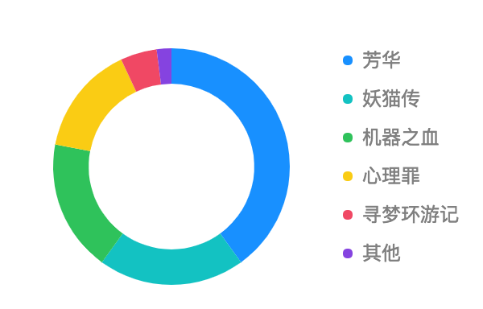

# Coordinate

F2 supports two kinds of coordinates, Cartesian coordinate and polar coordinate. Cartesian coordinate is used by default.

### Configuration

#### Cartesian Coordinate

```javascript
// use Cartesian coordinate
chart.coord('rect');
// transpose coordinate, needed when drawing bar chart(horizontal)
chart.coord({
  transposed: true
});
chart.coord('rect', {
  transposed: true
});
```

#### Polar Coordinate

```javascript
// use polar coordinate
chart.coord('polar');
// more configurations
chart.coord('polar', {
  transposed: true, // transpose coordinate
  startAngle: {Number}, // starting angle
  endAngle: {Number}, // ending angle
  innerRadius: {Number}, // Inner ring radius, range of [0, 1]
  radius: {Number} // radius, range of [0, 1]
});
```

### Get Coordinate Instance

```javascript
chart.get('coord')
```

The method will return the coordinate instance of current chart. Different coordinate types contain different properties.

#### Cartesian Coordinate 

If it is a cartesian coordinate instance, it will contain the following properties:

| **Name** | **Type** | **Description** |
| :--- | :--- | :--- |
| `start` | Object | The starting point of the coordinate in canvas, the origin of the coordinate in F2 chart is located in the lower left corner. The value is like `{ x: 10, y: 10 }` |
| `end` | Object | The position of upper right corner of the coordinate system in canvas. The value is like `{ x: 100, y: 100 }` |
| `transposed` | Boolean | Wether the coordinate is transposed, true means it is transposed. |
| `isRect` | Boolean | Indicating that it is a Cartesian coordinate. |

#### Polar Coordinate

If it is a polar coordinate instance, it will contain the following properties:

| **Name** | **Type** | **Description** |
| :--- | :--- | :--- |
| `startAngle` | Number | The starting angle of polar coordinate |
| `endAngle` | Number | The ending angle of polar coordinate |
| `innerRadius` | Number | The internal hollow radius when a ring is drawn, relative value, range of \[0, 1\] |
| `radius` | Number | The radius of the circle, relative value, range of \[0, 1\] |
| `isPolar` | Boolean | Wether it is a polar coordinate, true if it is |
| `transposed` | Boolean | Wether it is transposed, true means it is |
| `center` | Object | The canvas coordinates of the center of the polar coordinates |
| `circleRadius` | Number | radius of the polar coordinate |

### Demos

#### Donut Chart



```javascript
const data = [
  { name: '芳华', proportion: 0.4, a: '1' },
  { name: '妖猫传', proportion: 0.2, a: '1' },
  { name: '机器之血', proportion: 0.18, a: '1' },
  { name: '心理罪', proportion: 0.15, a: '1' },
  { name: '寻梦环游记', proportion: 0.05, a: '1' },
  { name: '其他', proportion: 0.02, a: '1' },
];
const chart = new F2.Chart({
  id: 'ring',
  width: 300,
  height: 192,
  pixelRatio: window.devicePixelRatio,
});
chart.source(data);
chart.legend({
  position: 'right'
});
chart.coord('polar', {
  transposed: true,
  innerRadius: 0.7,
});
chart.axis(false);
chart.interval().position('a*proportion')
  .color('name', [ '#1890FF', '#13C2C2', '#2FC25B', '#FACC14','#F04864', '#8543E0' ])
  .adjust('stack');
chart.render();
```

#### Draw a semicircle pie chart


```javascript
const data = [
  { name: '芳华', proportion: 0.4, a: '1' },
  { name: '妖猫传', proportion: 0.2, a: '1' },
  { name: '机器之血', proportion: 0.18, a: '1' },
  { name: '心理罪', proportion: 0.15, a: '1' },
  { name: '寻梦环游记', proportion: 0.05, a: '1' },
  { name: '其他', proportion: 0.02, a: '1' },
];
const chart = new F2.Chart({
  id: 'pie',
  width: 300,
  height: 193,
  pixelRatio: window.devicePixelRatio,
});
chart.source(data);
chart.legend({
  position: 'bottom',
  align: 'center'
});
chart.coord('polar', {
  transposed: true,
  startAngle: -Math.PI, // set the starting angle
  endAngle: 0 // set the ending angle
});
chart.axis(false);
chart.interval().position('a*proportion')
  .color('name', [ '#1890FF', '#13C2C2', '#2FC25B', '#FACC14', '#F04864', '#8543E0' ])
  .adjust('stack');
chart.render();
```

