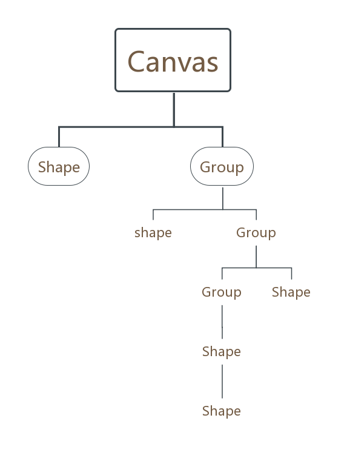

# G

`G` is the renderer engine of F2, it has following feature:

1. Layering structure
2. Supports the creation, modification and destruction of the groups and shapes.
3. Animation
4. Matrix transformation.



* Canvas is the entrance, it includes all the Group and Shape objects.
* Group can contains Group and Shape instances.
* G offers a variety of Shape types

### How to Get `G` 

```javascript
const F2 = require('@antv/f2');
const { G } = F2;
```

### Namespace: G

#### Classes

* [Canvas](https://antv.gitbook.io/f2/api/canvas)
* [Group](https://antv.gitbook.io/f2/api/group)
* [Shape](https://antv.gitbook.io/f2/api/shape)
  * [Line](https://antv.gitbook.io/f2/api/shape#line)
  * [Arc](https://antv.gitbook.io/f2/api/shape#arc)
  * [Circle](https://antv.gitbook.io/f2/api/shape#circle)
  * [Polygon](https://antv.gitbook.io/f2/api/shape#polygon)
  * [Polyline](https://antv.gitbook.io/f2/api/shape#polyline)
  * [Rect](https://antv.gitbook.io/f2/api/shape#rect)
  * [Sector](https://antv.gitbook.io/f2/api/shape#sector)
  * [Text](https://antv.gitbook.io/f2/api/shape#text)
  * [Custom](https://antv.gitbook.io/f2/api/shape#custom)

**Namespaces** 

* [Matrix](https://antv.gitbook.io/f2/api/matrix)
* [Vector2](https://antv.gitbook.io/f2/api/vector2)

### Quick Look


```javascript
<script src="https://unpkg.com/@antv/f2"></script>
<canvas id="container"></canvas>
<script>
    const { Canvas } = F2.G; // require Canvas
    const canvas = new Canvas({
      el: 'canvas',
      width: 200,
      height: 100
    }); // create a canvas instance
    const container = canvas.addGroup({
      zIndex: 2
    }); // add a group to canvas 
    const itemGroup = container.addGroup({
      zIndex: 1
    }); // add a group to container 
    itemGroup.addShape('circle', {
      attrs: {
        x: 5,
        y: 0,
        r: 5,
        fill: 'red'
      }
    }); // add a circle to group
    itemGroup.addShape('text', {
      attrs: {
        x: 17,
        y: 0,
        textAlign: 'start',
        textBaseline: 'middle',
        fontSize: 12,
        fill: 'red',
        text: '分类一'
      }
    }); // add text to group
    const bbox = itemGroup.getBBox(); // get the bounding box of the group in order to calculate the display position of other graphs
    container.addShape('rect', {
      zIndex: 0,
      attrs: {
        x: bbox.minX - 5,
        y: bbox.minY - 5,
        width: bbox.width + 10,
        height: bbox.height + 10,
        fill: 'rgba(0, 0, 0, 0.09)',
        radius: 4
      }
    }); // add a rectangle
    container.sort(); // sort by zIndex.
    container.moveTo(30, 50); // move the container to (30, 50)
    
    canvas.addShape('rect', {
      zIndex: 0,
      attrs: {
        x: 0,
        y: 0,
        width: 200,
        height: 100,
        fill: 'rgba(0, 0, 0, 0.09)',
        radius: 4
      }
    }); // add a rectangle
    
    canvas.sort();
    canvas.draw(); // draw
</script>
```


