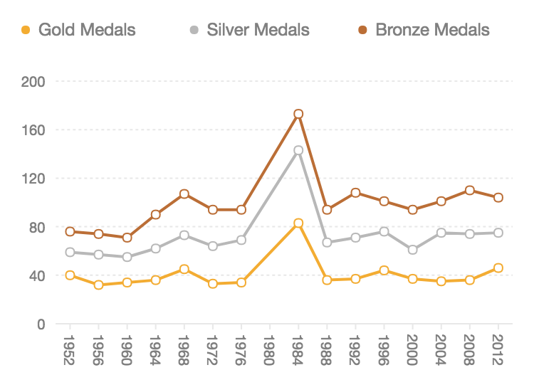
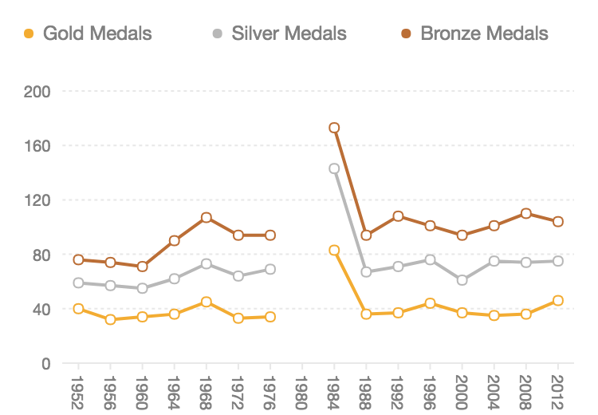

# Geometry

The type of the chart is determined by geometry.

```javascript
chart.<geomType>()
  .position()
  .size()
  .color()
  .shape()
  .adjust()
  .style()
  .animate();
```

The following is a simple grammar for a basic bar chart..

```javascript
chart.interval().position('x*y').color('x');
```

**NOTE: The return of the above method `chart.interval()` is a geom instance, not a chart instance.**

Currently we support 7 geometry types：

| **Type** | **Description** |
| :--- | :--- |
| `point` | point, used for drawing point chart, scatter chart, bubble chart. |
| `path` | path, a line of unordered connected. |
| `line` | line, used for drawing line chart, and the data will be ordered. |
| `area` | area, used for drawing area chart |
| `interval` | used to form a bar chart or a pie chart. |
| `polygon` | It is usually used to form heat map chart or map. |
| `schema` | Used to form a candlesticks chart or box chart. |

## Properties

### `generatePoints`

* type: `Boolean`
* description: Wether to generate multiple points to draw charts, if true, multiple points will be generated.
* default: false for line and path, other geometry types default to be true.

```javascript
chart.line({
  generatePoints: true
})
```

### `sortable`

* type: `Boolean`
* description: Whether to sort the data according to the corresponding field of the x-axis, and sort it when true
* default: `true` for area and line, other geometry types default to be false.

**Note: When drawing a line or area chart, if your data has been sorted, you can set this property to `false` to improve processing performance.**

```javascript
chart.line({
  sortable: false
})
```

### `startOnZero`

* type: `Boolean`
* description: Wether to set the baseline of the y-axis starting from 0, default to be true, means starts from 0.
* default: true

```javascript
chart.line({
  startOnZero: false
})
```

The usage scenarios for this property are as follows:

| `startOnZero: true` | `startOnZero: false` |
| :--- | :--- |
| [](https://camo.githubusercontent.com/a03204b2b0ff11bd440af83602676ca785f38278/68747470733a2f2f67772e616c697061796f626a656374732e636f6d2f7a6f732f726d73706f7274616c2f5a5171775543637a616c724b71476761674f56702e706e67) | [](https://camo.githubusercontent.com/f18b3a9ff0994c86ebdbae3f2903915fbef9d237/68747470733a2f2f67772e616c697061796f626a656374732e636f6d2f7a6f732f726d73706f7274616c2f795073776b615876557043594f64686f634777422e706e67) |

### connectNulls

* type: `Boolean`
* description:  Used to set whether to connect empty data \(for line, area and path types\)
* default: false

```javascript
chart.line({
  connectNulls: true // connect empty data
});
```

| `connectNulls: true` | `connectNulls: false` |
| :--- | :--- |
| [](https://camo.githubusercontent.com/a03204b2b0ff11bd440af83602676ca785f38278/68747470733a2f2f67772e616c697061796f626a656374732e636f6d2f7a6f732f726d73706f7274616c2f5a5171775543637a616c724b71476761674f56702e706e67) | [](https://camo.githubusercontent.com/f18b3a9ff0994c86ebdbae3f2903915fbef9d237/68747470733a2f2f67772e616c697061796f626a656374732e636f6d2f7a6f732f726d73706f7274616c2f795073776b615876557043594f64686f634777422e706e67) |

## Methods

### `position()`

Declare the two data fields which determine the position of data points.  
Choose one of the following two ways to declare：

```javascript
chart.line().position('x*y');
chart.line().position([ 'x', 'y' ]);
```

The following code will render a bar chart, which the x-axis representing the `fruit` and the y-axis representing the `price`.

```javascript
const data = [
  { fruit: 'apple', price: 2 },
  { fruit: 'orange', price: 1.5 },
  { fruit: 'banana', price: 0.8 }
];
const chart = new F2.Chart({
  id: 'mountNode',
  pixelRatio: window.devicePixelRatio
});
chart.source(data);
chart.interval().position('fruit*price');
chart.render();
```


### `color()`

A method of mapping data values ​​to the color of the geometry.

```javascript
chart.line().color('red');  // Color
chart.line().color('fieldName'); // use the built-in colors to map field
chart.line().color('fieldName', [ 'red', 'blue' ]) // specify colors
chart.line().color('fieldName', (type) => { // use callback to map data to colors
  if (type === 'a') {
    return 'red';
  }
  return 'blue';
});
chart.line().color('fieldName*value', (type, value) => { // multiple parameters, use callback to map
  if (type === 'a' && value > 100) {
    return 'red';
  }
  return 'blue';
});
```

#### **color\(value\)**

* `value`: String

At this time, value can be:

* The data field mapped to the color attribute. If the field name does not exist in the data, it will be parsed as a constant. This time, the default color provided by F2 will be used.
* also can be a specific color value, such as 'red', '\#ddd', '\#dddddd', 'rgb\(255, 10, 30\)'.

```javascript
chart.point().position('x*y').color('x'); // use the built-in color to map the data field of x-axis
chart.point().position('x*y').color('red'); // all points are mapped to red
```

#### **color\(fieldName, colors\)**

* `fieldName`: String

  Data field name mapped to colors, multiple fields are supported.

* `colors`: String / Array / Function

  * If colors is null, the built-in colors are used;
  * If you need to specify colors, you need to pass in an color array.


  ```javascript
  chart.point().position('x*y').color('z'); // use default colors
  chart.point().position('x*y').color('z', [ 'red', 'blue' ]); // specify colors
  ```

  * When the map field is a linear scale type\(for continuous quantitative data\), you can declare the gradient color as follows, detailed demo [here](https://antv.alipay.com/zh-cn/f2/3.x/demo/other/heatmap.html).

  ```javascript
  chart.polygon().position('name*day').color('sales', '#BAE7FF-#1890FF-#0050B3')
  ```

* Colors can also be a callback function, the parameters of the callback are the data field values. If the function is going to map multiple data fields, parameters will be passed in the declared order, for example:


```javascript
const data = [
  { fruit: "apple", price: 2 },
  { fruit: "orange", price: 1.5 },
  { fruit: "banana", price: 0.8 }
];
const chart = new F2.Chart({
  id: 'mountNode',
  pixelRatio: window.devicePixelRatio
});
chart.source(data);
chart.interval().position('fruit*price').color('fruit', val => {
  if (val === 'apple') {
    return '#CD0110';
  } else if (val === 'orange') {
    return '#F88825';
  } else if (val === 'banana') {
    return '#FAD639';
  }
});
chart.render();
```

### `shape()`

A method of mapping data values ​​to the shape of the geometry.

```javascript
chart.point().shape('circle'); // a specific shape
chart.point().shape('fieldName'); // use the built-in shapes to map the data field
chart.point().shape('fieldName', [ 'circle', 'hollowCircle', 'rect' ]); // specify shapes
chart.point().shape('fieldName', (type) => { // use callback do the mapping
  if(type === 'a') {
    return 'circle';
  }
  return 'rect';
});
```

#### **shape\(shapeName\)**

* `shapeName`: String

        Specify the shape that the geometry draws. The following table lists the shapes supported by different geometry types:

| **Geometry Type** | **Supported Shape** | **Description** |
| :--- | :--- | :--- |
| point | 'circle', 'hollowCircle', 'rect' |  'circle' is default |
| line | 'line', 'smooth', 'dash' | 'line' is default, 'dash': dash line, 'smooth': smooth line |
| area | 'area', 'smooth' | 'area' is default |
| interval | 'rect' |  |
| polygon | 'polygon' |  |
| schema | 'candle' | only candlestick chart is supported currently |

```javascript
chart.point().position('x*y').shape('rect'); // all the points's shapes are rectangles
```

#### **shape\(fieldName, shapes\)**

* `fieldName`: String

  The name of the data field that maps to the shape attribute.

* `shapes`: String / Array / Function

  `shapes` is an optional parameter. 

* * If this parameter is not provided, shapes will be rendered  defaultly. 

  ```javascript
  // use default point shapes, 'circle', 'hollowCircle', 'rect'
  chart.point().position('x*y').shape('z'); 
  ```

  *   Users can also specify shapes to render. The specific shapes are listed above.

  ```javascript
  chart.point().position('x*y').shape('z', [ 'circle', 'rect' ]); // specify shapes
  ```

  * `shapes` can also be a callback function, the parameters of the callback are the data field values. If the function is going to map multiple data fields, parameters will be passed in the declared order, for example:


```javascript
const data = [
  { fruit: "apple", price: 2 },
  { fruit: "orange", price: 1.5 },
  { fruit: "banana", price: 0.8 }
];
const chart = new F2.Chart({
  id: 'mountNode',
  pixelRatio: window.devicePixelRatio
});
chart.source(data);
chart.point().position('fruit*price').shape('fruit', val => {
  if (val === 'apple') {
    return 'rect';
  } else if (val === 'orange') {
    return 'hollowCircle';
  } else if (val === 'banana') {
    return 'circle';
  }
});
chart.render();

```

### size\(\)

A method of mapping data values ​​to the size of the geometry.

```javascript
chart.point().size(10); // specific size
chart.point().size('fieldName'); // the value mapped to the size
chart.point().size('fieldName', [ 0, 10 ]); // the value mapped to the size, and specify maximum and minimum values
chart.point().size('fieldName', val => { // 回调函数
  if (val > 5) {
    return 10;
  }
  return 5;
});
```

**size\(field, \[ min, max \]\)**

Map the size of the geometry based on the value of the field, the maximum value \(default to 10\) and minimum value \(default to 1\) are specified by max and min.

```javascript
// map the value in field z to size, the maximum mapped value is 100, minimum mapped value is 10.
chart.point().position('x*y').size('z', [ 10, 100 ]); 
```

#### **size\(field, callback\)**

Use callback function to calculate the size of the geometry.

```javascript
chart.point().position('x*y').size('z', value => {
  if (value === 1) {
    return 5;
  }
  return 10;
});
```

### `adjust()`

Declare the data adjustment method for the geometry instance, which can be used to draw stacked charts, grouped charts, etc.

F2 supports two kinds of data adjustment: `stack` and `dodge`.

```javascript
chart.interval().adjust('stack');
chart.interval().adjust({
  type: 'stack'
});
chart.interval().adjust([{
  type: 'dodge',
  marginRatio: 0, // Values from 0 to 1 are used to adjust the space between bars in a group
}]);
```


```javascript
  const data =[
    { city: 'London', month: 'Jan.', rainfall: 18.9 },
    { city: 'London', month: 'Feb.', rainfall: 28.8 },
    { city: 'London', month: 'Mar.', rainfall: 39.3 },
    { city: 'London', month: 'Apr.', rainfall: 81.4 },
    { city: 'London', month: 'May.', rainfall: 47 },
    { city: 'London', month: 'Jun.', rainfall: 20.3 },
    { city: 'London', month: 'Jul.', rainfall: 24 },
    { city: 'London', month: 'Aug.', rainfall: 35.6 },
    { city: 'Berlin', month: 'Jan.', rainfall: 12.4 },
    { city: 'Berlin', month: 'Feb.', rainfall: 23.2 },
    { city: 'Berlin', month: 'Mar.', rainfall: 34.5 },
    { city: 'Berlin', month: 'Apr.', rainfall: 99.7 },
    { city: 'Berlin', month: 'May.', rainfall: 52.6 },
    { city: 'Berlin', month: 'Jun.', rainfall: 35.5 },
    { city: 'Berlin', month: 'Jul.', rainfall: 37.4 },
    { city: 'Berlin', month: 'Aug.', rainfall: 42.4 }
  ];
  const chart = new F2.Chart({
    id: 'mountNode',
    pixelRatio: window.devicePixelRatio
  });
  chart.source(data, {
    rainfall: {
      tickCount: 5
    }
  });
  
  chart.interval().position('month*rainfall').color('city').adjust('stack');
  chart.render();
```

### `style()`

Used to configure the display the geometries, see [Canvas](https://antv.gitbook.io/f2/api/canvas-api-in-f2) for more details.

There are two ways to use `style()` method:

#### `style(cfg)`

* `cfg`: Object, configuration for graphical attributes, see [Canvas](https://antv.gitbook.io/f2/api/canvas-api-in-f2) for more details.

```javascript
chart.line().style({ // style for all shapes
  lineWidth: 2
});
```

#### `style(field, cfg)` 

Mapping from data fields to style configuration.

* `field`: String, field name of data
* `cfg`: Object, configuration for graphical attributes, **callback is also supported here**

```javascript
chart.ling().style('city', {
  lineDash(val) {
    if (val === 'HZ') {
      return [ 2, 2 ];
    }
    return null;
  }
})
```

### `animate()`

Configuration for geometry's animation.Includes animation type, duration time and easing function and so on.

```javascript
chart.point().animate(false); // turn off animation

chart.point().animate({
  appear: {
    animation: {String}, // animation name
    easing: {String}, // easing function
    duration: {Number}, // duration time of the animation, ms is the unit
    delay: {Number} // delay of the animation, ms is the unit
  }, // entrance animation
  update: {
    animation: {String}, 
    easing: {String},
    duration: {Number},
    delay: {Number} 
  }, // updating animation
  enter: {
    animation: {String}, 
    easing: {String}, 
    duration: {Number}, 
    delay: {Number} 
  }, // animation for the change of the source data
  leave: {
    animation: {String}, 
    easing: {String}, 
    duration: {Number}, 
    delay: {Number} 
  } // destroy animation
});
```

For more about animations, see [Animation](https://antv.gitbook.io/f2/api/animation).

