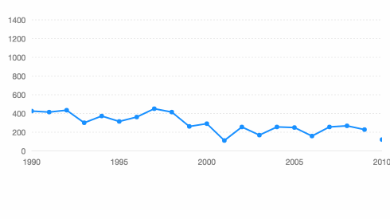

# Pan



Based on `pan`  gesture\( from [Hammer.js](http://hammerjs.github.io/recognizer-pan/)\), it also provides `press`  gesture to trigger the interaction of the tooltip.

### How to use

```javascript
const F2 = require('@antv/f2/lib/index'); // require F2
require('@antv/f2/lib/interaction/pan'); // require the interaction

// ... create a chart instance

// call the interaction, should be call before chart.render()
chart.interaction('pan');
```

### Configuration options {#configuration-options}

```javascript
chart.interaction('pan', {
  mode: {String}, 
  panThreshold: {Number}, 
  pressThreshold: {Number},
  pressTime: {Number},
  limitRange: {Object},
  onStart: {Function},
  onProcess: {Function},
  onEnd: {Function}
});
```

| Name | Type | Default | Description |
| :--- | :--- | :--- | :--- |
| `mode` | String | 'x' | The direction of pan, can be 'x', 'y' or 'xy'. The default value is 'x'. |
| `panThreshold` | Number | 10 | Minimal pan distance required before recognizing. |
| `pressThreshold` | Number | 9 | Minimal movement that is allowed while pressing. press will trigger tooltip. |
| `pressTime` | Number | 251 | Minimal press time in ms. |
| `limitRange` | Object | Automatic calculation based on the range of data | The maximum and minimum range used to set the chart, needs to correspond to the data field corresponding to the x or y axis. Use the following: `limitRange: {     fieldA: {         min: 0,         max: 100     } }`   |
| `onStart` | Function | null | The callback after the start event is triggered. |
| `onPress` | Function | null | The callback after the process event is triggered. |
| `onEnd` | Function | null | The callback after the end event is triggered. |

### Demo

* [pan on x-axis](https://antv.alipay.com/zh-cn/f2/3.x/demo/interaction/x-pan.html)
* [bar chart pan](https://antv.alipay.com/zh-cn/f2/3.x/demo/interaction/steps-pan.html)
* [pan on xy-axis](https://antv.alipay.com/zh-cn/f2/3.x/demo/interaction/xy-pinch-pan.html)

