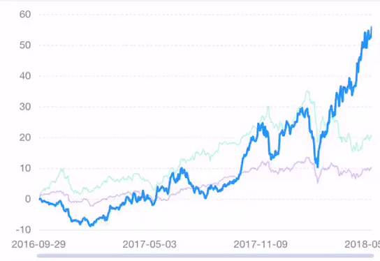

# Pinch



Based on `pinch`  gesture\( from [Hammer.js](http://hammerjs.github.io/recognizer-pinch/)\), it also provides `press`  gesture to trigger the interaction of the tooltip.

### How to use

```javascript
const F2 = require('@antv/f2/lib/index'); // require F2
require('@antv/f2/lib/interaction/pinch'); // require the interaction

// ... create a chart instance

// call the interaction, should be call before chart.render()
chart.interaction('pinch');
```

### Configuration options {#configuration-options}

```javascript
chart.interaction('pinch', {
  mode: {String}, 
  minScale: {Number}, 
  maxScale: {Number},
  pressThreshold: {Number},
  pressTime: {Object},
  onStart: {Function},
  onProcess: {Function},
  onEnd: {Function}
});
```

| Name | Type | Default | Description |
| :--- | :--- | :--- | :--- |
| `mode` | String | 'x' | The direction of pinch, can be 'x', 'y' or 'xy'. The default value is 'x'. |
| `minScale` | Number | 1 or null | Set the minimum scale. Linear data default value is 1, cat or timeCat data default value is null. |
| `maxScale` | Number | 4 or null | Set the maximum scale. Linear data default value is 4, cat or timeCat data default value is null. |
| `pressThreshold` | Number | 9 | Minimal movement that is allowed while pressing. Press will trigger tooltip. |
| `pressTime` | Number | 251 | Minimal press time in ms. |
| `onStart` | Function | null | The callback after the start event is triggered. |
| `onPress` | Function | null | The callback after the process event is triggered. |
| `onEnd` | Function | null | The callback after the end event is triggered. |

### Demo

* [pinch on x-axis](https://antv.alipay.com/zh-cn/f2/3.x/demo/interaction/pinch-and-pan-for-smooth-line.html)
* [pinch on xy-axis](https://antv.alipay.com/zh-cn/f2/3.x/demo/interaction/pinch-and-pan-for-scatter-chart.html)
* [pinch for time type data](https://antv.alipay.com/zh-cn/f2/3.x/demo/interaction/pinch-and-pan-for-line-chart.html)

