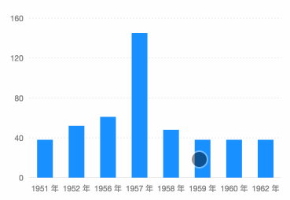

# Selection for Bar Chart



### How to use

```javascript
const F2 = require('@antv/f2/lib/index'); // require F2
require('@antv/f2/lib/interaction/interval-select'); // require the interaction

// ... create a chart instance

// call the interaction, should be call before chart.render()
chart.interaction('interval-select');
```

### Configuration options {#configuration-options}

```javascript
chart.interaction('interval-select', {
  startEvent: {String},
  selectStyle: {Object},
  unSelectStyle: {Object},
  selectAxis: {Boolean},
  selectAxisStyle: {Object},
  cancelable: {Boolean},
  onStart: {Function}, 
  onEnd: {Function}, 
  mode: {String}
});
```

| Name | Type | Default | Description |
| :--- | :--- | :--- | :--- |
| startEvent | String | 'tap' |  |
| selectStyle | Object |  |  |
| unSelectStyle | Object |  |  |
| selectAxis | Boolean |  |  |
| selectAxisStyle | Object |  |  |
| cancelable | Boolean |  |  |
| onStart | Function |  |  |
| onEnd | Function |  |  |
| mode | String |  |  |

### Demo:[https://antv.alipay.com/zh-cn/f2/3.x/demo/interaction/interval-select.html](https://antv.alipay.com/zh-cn/f2/3.x/demo/interaction/interval-select.html)

