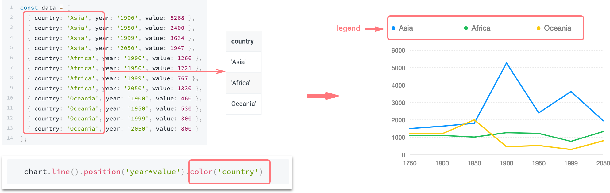

# Legend

The legend for F2 is determined by the [color](https://antv.gitbook.io/f2/api/geometry#color) mapping. When the data mapped to color is a cat scale\(for discrete ordinal \(ordered\) or categorical \(unordered\) data\), a legend is generated.



### How to Register Legend Plugin

F2 has modular structure provides best tree-shaking results and package size optimization. 

If you just **`import F2 from '@antv/f2'`**, then **it has included legend by default**. But if you want a better package size optimization, you can register manually:

```javascript
const F2 = require('@antv/f2/lib/core');
const Legend = require('@antv/f2/lib/plugin/legend');
// Method 1: Global Registeration
F2.Chart.plugins.register(Legend); 

// Or Method2: Registeration for a Chart instance
const chart = new F2.Chart({
  id: 'canvas',
  plugins: Legend
});
```

## Legend Configuration

### Close the Legend

#### `chart.legend(false)`

Just close all legends. Sometimes there will be several legends.

#### `chart.legend(field, false)`

* `field`: String type, the map field of the legend.

Close the legend corresponding to the field.

### Configure Legend

#### `chart.legend(field, config)`

* `field`: String, the map field of the legend.
* `config`: Object type, configuration for the axis. The properties included are as follows:

| Name | Type | Default | Description |
| :--- | :--- | :--- | :--- |
| `position` | String | 'top' | The display position of the legend, can be set to **'top'**, **'right'**, **'bottom'**, **'left'**, defaults to 'top'. |
| `align` | String | 'left' | It is used to set the alignment of the legend in the horizontal direction, when `position` is set to be 'top' or 'bottom'.The values that can be set are: **'left'**, **'center'**, **'right',** and the default is 'left'. See [demos](https://antv.gitbook.io/f2/api/legend#legend-align-demos). |
| `verticalAlign` | String | 'middle' | It is used to set the alignment of the legend in the vertical direction, when `position` is set to 'left' and 'right'. The values that can be set are: **'top'**, **'middle'**, **'bottom'**, and the default is 'middle'. See [demos](https://antv.gitbook.io/f2/api/legend#legend-verticalalign-demos). |
| `itemWidth` | Number \| 'auto' | 'auto' | It is used to set width of the legend item, **defaults to `'auto'`**, using the default layout of F2 to calculate the width. If the `itemWidth` is set to `null`, it will be calculated based on the width of the legend  itself, developers are also allowed to set the value of the `itemWidth`, such as `itemWidth: 50` |
| `showTitle` | Boolean | false | wether show the title of the legend, default to false. |
| `titleStyle` | `Object` | `{ fontSize: 12, fill: '#fff', textAlign: 'start', textBaseline: 'top' }` | Configure the style of legend title. see [Canvas](https://antv.gitbook.io/f2/api/canvas-api-in-f2) for more details. |
| `offsetX` | Number | 0 | The offset of the legend in x direction. The value unit is 'px' and the default value is 0. |
| `offsetY` | Number | 0 | The offset of the legend in y direction. The value unit is 'px' and the default value is 0. |
| `titleGap` | Number | 12 | The distance between the title and the legend items, defaults to 12\(px\). If the title is not displayed, it is invalid. |
| `itemGap` | Number | 12 | The distance between legend's items in horizontal direction, defaults to 12\(px\). |
| `itemMarginBottom` | Number | 12 | The distance in the vertical direction from the next legend item, defaults to 12\(px\). |
| `wordSpace` | Number | 6 | The distance between the marker and legend label, defaults to 6\(px\). |
| `unCheckStyle` | Object | `{ fill: '#bfbfbf'}` | Used to set the style of the marker and text in the legend item that is not selected. |
| `itemFormatter` | Function | null | Callback for formatting the text in legend. See [callback](https://antv.gitbook.io/f2/api/legend#itemformatter-callback). |
| `marker` | String/Function/Object | 'circle' | It is used to set the marker style of the legend, defaults to 'circle'.  See custom [marker](https://antv.gitbook.io/f2/api/legend#custom-maker) for detail. |
| `nameStyle` | Object | see [source](https://github.com/antvis/f2/blob/master/src/plugin/legend.js#L17) | It is used to set the text style of the legend, see [Canvas](https://antv.gitbook.io/f2/api/canvas-api-in-f2) for more details. [Demo](https://antv.gitbook.io/f2/api/legend#legend-item-interface). |
| `valueStyle` | Object | see [source](https://github.com/antvis/f2/blob/master/src/plugin/legend.js#L23) | It is used to set the text style of the legend, see [Canvas](https://antv.gitbook.io/f2/api/canvas-api-in-f2) for more details.[Demo](https://antv.gitbook.io/f2/api/legend#legend-item-interface). |
| `joinString` | String | ':' | Set the connection character for name and value in the legend item. The default is ':'. |
| `triggerOn` | String | 'touchstart' | The trigger event of the legend filter behavior, the default is 'touchstart'. |
| `selectedMode` | String | 'multiple' | Set the selected mode of the legend, provide two modes: 'multiple' and 'single' |
| `clickable` | Boolean | true | wether the legend is clickable, defaults to `true`. |
| `onClick` | Function | null | callback for clicking the legend, invalid when `clickable` is false. see [here](https://antv.gitbook.io/f2/api/legend#onclick-callback) for detail. |
| `custom` | Boolean | false | when `custom` is `true`, users are allowed to customize legends, including the specific legends and corresponding interactions. The default value is `false`. See here for [detail](https://antv.gitbook.io/f2/api/legend#custom-legend). |

#### Legend `align` demos

When `position` is set to be 'top' or 'bottom', you can set `align` property:

| `align: 'left'` | `align: 'center'` | `align: 'right'` |
| :--- | :--- | :--- |
| [](https://camo.githubusercontent.com/be8e0e3ef93f5f7dd39cb7d65883035a0b695724/68747470733a2f2f67772e616c697061796f626a656374732e636f6d2f7a6f732f736b796c61726b2f31346534336238362d623064332d343662662d616136312d6439643335653430616663332f323031382f706e672f35386466666433372d616337302d343636612d386162302d3766663732393932376335322e706e67) | [](https://camo.githubusercontent.com/cbb062c1a0b4ebd559f20b7da3604acd1a9ded92/68747470733a2f2f67772e616c697061796f626a656374732e636f6d2f7a6f732f736b796c61726b2f38623631363530352d363333362d343432332d623630302d6566306564613565343363662f323031382f706e672f37316366666537652d326365632d346136342d393864302d3330646332356536303161352e706e67) | [](https://camo.githubusercontent.com/ad328e11860319838b137e39a3fa7f2e9341a8e9/68747470733a2f2f67772e616c697061796f626a656374732e636f6d2f7a6f732f736b796c61726b2f61393534656431342d386233322d346364642d386537652d6330313864363432636432632f323031382f706e672f64353862383634372d633562322d346630332d393036642d3434333836363533363962392e706e67) |

#### Legend `verticalAlign` demos

When `position` is set to be 'left' or 'right', you can set `verticalAlign` property:

| `verticalAlign: 'middle'` | `verticalAlign: 'top'` | `verticalAlign: 'bottom'` |
| :--- | :--- | :--- |
| [](https://camo.githubusercontent.com/da7ec8efeafbc869309caebb2eed5651e62c6473/68747470733a2f2f67772e616c697061796f626a656374732e636f6d2f7a6f732f736b796c61726b2f33653335313039302d396539312d343462372d396337392d3966616531353736613833652f323031382f706e672f39306434616238322d306261612d343239632d613932612d6562303663353165396230642e706e67) | [](https://camo.githubusercontent.com/18573904a457ce9d705ead36a0e5575061f1cbae/68747470733a2f2f67772e616c697061796f626a656374732e636f6d2f7a6f732f736b796c61726b2f61366438653763642d393531622d343039652d393663372d6237366134396563303430352f323031382f706e672f36353034643030312d336264382d346533642d616364392d3063316664613539356130662e706e67) | [](https://camo.githubusercontent.com/6a40d00f7038d0f33652d9dbf02ce1afd120aa36/68747470733a2f2f67772e616c697061796f626a656374732e636f6d2f7a6f732f736b796c61726b2f65356137376164612d663462632d346163642d393631312d6161633566393736396134312f323031382f706e672f37393566373062302d383962632d346231622d613864362d6232366235343335323163342e706e67) |

#### `itemFormatter` callback

Use this property to complete the formatted display of the legend item text.  See detailed [demo](https://antv.alipay.com/zh-cn/f2/3.x/demo/pie/pie.html).

```javascript
chart.legend({
  position: 'right',
  itemFormatter(val) {
    return val + ' %';
  }
});
```

#### Custom `maker`


The following describes the specific use of the `marker`：

*  When `marker` is a **String**, F2 provides the following types：`marker: 'circle'` or `marker: 'square'`
* when `marker` is an **Object**, you can configure the type of marker and its style.

```javascript
chart.legend({
  marker: {
    symbol: 'circle', // shape of the marker
    radius: 5 // radius of the circle
  }
});
```

* When marker is a **Function**, you can customize the shape you need

```javascript
chart.legend({
  /**
   * customize the shape of marker
   * @param  {number} x   x-axis of the marker
   * @param  {number} y   y-axis of the marker
   * @param  {number} r   radius of the marker
   * @param  {object} ctx context object of the canvas
   * @return {null}     
   */
  marker(x, y, r, ctx) {}
});
```

The following code draws a marker shown below: 


```javascript
chart.legend('city', {
  marker(x, y, r, ctx) {
    ctx.lineWidth = 2;
    ctx.strokeStyle = ctx.fillStyle;
    ctx.moveTo(x - r - 3, y);
    ctx.lineTo(x + r + 3, y);
    ctx.stroke();
    ctx.arc(x, y, r, 0, Math.PI * 2, false);
    ctx.fill();
  }
});
```

#### `onClick` callback

See [demo](https://antv.alipay.com/zh-cn/f2/3.x/demo/legend/custom.html).

```javascript
chart.legend({
 /**
  * callback for clicking the legend, invalid when clickable is false.
  * @param  {object} event obejct
  * @return {null}
  */
 onClick: ev => {
    const { clickedItem } = ev; // get the clicked legend item
 }
});
```

#### Legend Item Interface

The Legend item implement the following interface，the image below will help you better understand:


```javascript
{
  // Label that will be displayed as name
  name: String,
  
  // Label that will be displayed as value
  value: String / Number,
  
  // For marker, see Custom maker
  marker: String / Object / Function,
  
  // For setting the legend click style, if not set, the default is true
  checked: Boolean,
  
  // Fill style of the legend marker, you also can set in marker(when it is an object)
  fill: String
}
```

For example, use the custom legend feature to define legend items as follows:


```javascript
chart.legend({
  position: 'right',
  custom: true,
  items: [
    { name: 'TYPE A', value: '73.76%',  marker: { symbol: 'square', fill: '#1890FF', radius: 4 } },
    { name: 'TYPE B', value: '22.11%', marker: { symbol: 'square', fill: '#2FC25B', radius: 4 } },
    { name: 'TYPE C', value: '2.2%', marker: { symbol: 'square', fill: '#FACC14', radius: 4 } },
    { name: 'TYPE D', value: '1.93%', marker: { symbol: 'square', fill: '#F04864', radius: 4 } }
  ],
  nameStyle: {
    fill: '#808080'
  }, // For styling the name label
  valueStyle: {
    fill: '#333',
    fontWeight: 'bold' // For styling the value label
  }
});
```

#### Custom Legend

You can use the custom legend feature to customize the display content and style of the legend, and you can also use the `onClick` callback to define the interaction behavior of the legend.

Below is a demo, you can click on the legend to control the display and hide of the corresponding geometry，[Complete code](https://antv.alipay.com/zh-cn/f2/3.x/demo/legend/custom.html).


```javascript
chart.legend({
  custom: true,
  items: [
    { name: '个人分数', marker: 'square', fill: '#FACC14', checked: true }, 
    { name: '平均分数',
      marker: function marker(x, y, r, ctx) {
        ctx.lineWidth = 1;
        ctx.strokeStyle = ctx.fillStyle;
        ctx.moveTo(x - r - 3, y);
        ctx.lineTo(x + r + 3, y);
        ctx.stroke();
        ctx.arc(x, y, r, 0, Math.PI * 2, false);
        ctx.fill();
      },
      fill: '#000',
      checked: true
    }
  ],
  onClick(ev) {
    const item = ev.clickedItem;
    const name = item.get('name');
    const checked = item.get('checked');
    const children = item.get('children'); 
    if (checked) {
      const markerFill = children[0].attr('fill');
      const textFill = children[1].attr('fill');
      children[0].set('_originColor', markerFill); // 缓存 marker 原来的颜色
      children[1].set('_originColor', textFill); // 缓存文本原来的颜色
    }
    const geoms = chart.get('geoms');
    const canvas = chart.get('canvas');
    for (let i = 0; i < geoms.length; i++) {
      const geom = geoms[i];
      const container = geom.get('container');

      if (geom.getYScale().alias === name)
        if (!checked) {
          container.show();
          children[0].attr('fill', children[0].get('_originColor'));
          children[1].attr('fill', children[1].get('_originColor'));
        } else {
          container.hide();
          children[0].attr('fill', '#bfbfbf'); // marker 置灰
          children[1].attr('fill', '#bfbfbf'); // 文本置灰 置灰
        }
      item.set('checked', !checked);
      legendItems[findLegendItem(name)].checked = !checked;
    }
    canvas.draw();
  }
});
```

### More Legend Demos

| Demos |  |
| :--- | :--- |
| [top-center legend](https://antv.alipay.com/zh-cn/f2/3.x/demo/component/legend-align.html) |  |
| [legend style](https://antv.alipay.com/zh-cn/f2/3.x/demo/component/legend-custom-text-style.html) |  |
| [custom legend that can be clicked](https://antv.alipay.com/zh-cn/f2/3.x/demo/component/legend-custom.html) |  |
| [marker](https://antv.alipay.com/zh-cn/f2/3.x/demo/component/legend-marker.html) |  |
| [single mode](https://antv.alipay.com/zh-cn/f2/3.x/demo/component/legend-single-selected.html) |  |
| [right-top legend](https://antv.alipay.com/zh-cn/f2/3.x/demo/component/legend-vertical-align.html) |  |

