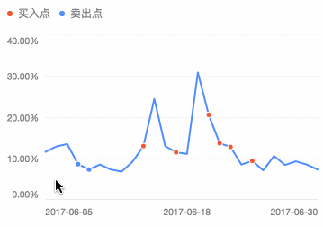

# Tooltip


### How to Register Tooltip Plugin

F2 has modular structure provides best tree-shaking results and package size optimization.

If you just **`import F2 from '@antv/f2'`**, then **it has included tooltip by default**. But if you want a better package size optimization, you can register manually:

```javascript
const F2 = require('@antv/f2/lib/core');
const Tooltip = require('@antv/f2/lib/plugin/tooltip');
// Method 1: Global Registeration
F2.Chart.plugins.register(Tooltip); 
​
// Or Method2: Registeration for a Chart instance
const chart = new Chart({
  id: 'canvas',
  plugins: Tooltip
});
```

## Tooltip Configuration {#legend-configuration}

### Close Tooltip

If you call `chart.tooltip(false)`, tooltip will not be rendered.

### Configure Tooltip

Below is the method for configuring tooltip, the detail properties can be found in table.

```javascript
chart.tooltip({
  // see detail properties in table
});
```

| **Name** | **Type** | **Default** | **Description** |
| :--- | :--- | :--- | :--- |
| `alwaysShow` | Boolean | false | Whether the tooltip is still show when the touch area is not in the chart.It can be set to be `true` to preserve displaying. |
| `offsetX` | Number | 0 | Tooltip offset in x direction. |
| `offsetY` | Number | 0 | Tooltip offset in y direction. |
| `triggerOn` | String / Array | \[ 'touchstart', 'touchmove' \] | The event that will trigger tooltip.  |
| `triggerOff` | String / Array | 'touchend' | The event that will hide tooltip. |
| `showTitle` | Boolean | false | Wether to show the title. |
| `showCrosshairs` | Boolean |  | Wether to show the tooltip crosshairs.  The default value of different charts is different, point, line, area and path will show by default. |
| `crosshairsStyle` | Object |  | Style of the crosshairs line, default setting is: `{     stroke: 'rgba(0, 0, 0, 0.25)',         lineWidth: 2   }` |
| `showTooltipMarker` | Boolean | true | Wether to display tooltipMarker. |
| `tooltipMarkerStyle` | Object |  | Style of the tooltipMarker. |
| `background` | Object |  | The background style of tooltip content box.  |
| `titleStyle` | Object |  | Style for tooltip's title, invalid if showTitle is `false.` |
| `nameStyle` | Object |  | Style for each tooltip item's name part. |
| `valueStyle` | Object |  | Style for each tooltip item's value part. |
| `showItemMarker` | Boolean | true | Wether to show the each tooltip item's marker. |
| `itemMarkerStyle` | Object |  | Style for each tooltip item's marker. |
| `custom` | Boolean | false | Wether to custom the tooltip. See [custom tooltip](https://antv.gitbook.io/f2/api/tooltip#custom-tooltip). |
| `onShow` | Function |  | Callback when the tooltip show. See [callback](https://antv.gitbook.io/f2/api/tooltip#onshow-callback). |
| `onHide` | Function |  | Callback when the tooltip hide. See [callback](https://antv.gitbook.io/f2/api/tooltip#onhide-callback). |
| `onChange` | Function |  | Callback when the tooltip content change. See [callback](https://antv.gitbook.io/f2/api/tooltip#onchange-callback). |

#### Tooltip Item Interface

The picture below shows the structure of tooltip content, it includes title and a group of items, each item consists of marker, name and value.


The tooltip items passed to the tooltip `onShow` , `onChange`, `onHide` callbacks implement the following interface:

```javascript
{
  // X position of matching tooltip item
  x: Number,
  
  // Y position of matching tooltip item
  y: Number,
  
  // Color of matching tooltip item
  color: String,
  
  // The data of matching tooltip item
  origin: Object,
  
  // The value of the `name` attribute in tooltip item
  name: String,
  
  // The value of the `value` attribute in tooltip item
  value: String / Number,
  
  // The title of current tooltip
  title: String
  
  // The marker of matching tooltip item
  marker: Object
}
```

#### `onShow` callback

We can use `onShow` callback to change the tooltip's show content. It will trigger when the tooltip is shown.

```javascript
chart.tooltip({
  onShow(obj) {}
});

// The following is the parameter `Obj` interface
{
  // X position of current event
  x: Number,
  
  // Y position of current event
  y: Number,
  
  // The tootlip instance
  tooltip: Object
  
  // Tooltip content items
  items: Array,
  
  // The style of tooltipMarker
  tooltipMarkerCfg: Object
}
```

As following example, we will change the value of name to the value of title, see demo and code [here](https://antv.alipay.com/zh-cn/f2/3.x/demo/line/basic.html).

```javascript
chart.tooltip({
  onShow: function onShow(ev) {
    var items = ev.items;
    items[0].name = items[0].title;
  }
});
```

#### `onChange` callback

It will trigger when the tooltip's content changed. Usually combined with the `custom` attribute for custom tooltip\(TODO\).

```javascript
chart.tooltip({
  onChange(obj) {}
});

// The following is the parameter `Obj` interface
{
  // X position of current event
  x: Number,
  
  // Y position of current event
  y: Number,
  
  // The tootlip instance
  tooltip: Object
  
  // Tooltip content items
  items: Array,
  
  // The style of tooltipMarker
  tooltipMarkerCfg: Object
}
```

#### `onHide` callback

It will trigger when the tooltip is disappeared. 

```javascript
chart.tooltip({
  onHide(obj) {}
});

// The following is the parameter `Obj` interface
{
  // The tootlip instance
  tooltip: Object
}
```

### Custom Tooltip

Custom tooltips allow you to hook into the tooltip rendering process so that you can render the tooltip in your own custom way. Generally this is used to [create an HTML tooltip](https://antv.gitbook.io/f2/api/tooltip#external-html-tooltip) instead of an canvas one or [combined with legend](https://antv.gitbook.io/f2/api/tooltip#combine-legend-and-tooltip).

#### Combine Legend and Tooltip

On mobile, in order to make better use of the screen size, the tooltip and legend are often combined in the chart design. Like this:


In F2, we can use  a custom tooltip to implement, see demo and code [here](https://antv.alipay.com/zh-cn/f2/3.x/demo/line/series.html): 

```javascript
chart.tooltip({
    custom: true, // required
    onChange(obj) {
      var legend = chart.get('legendController').legends.top[0]; // get the top legend instance
      var tooltipItems = obj.items;
      var legendItems = legend.items;
      var map = {};
      legendItems.map(function(item) {
        map[item.name] = _.clone(item);
      });
      tooltipItems.map(function(item) {
        var name = item.name;
        var value = item.value;
        if (map[name]) {
          map[name].value = value;
        }
      });
      legend.setItems(_.values(map)); // update legend items
    },
    onHide: function onHide() {
      var legend = chart.get('legendController').legends.top[0];
      legend.setItems(chart.getLegendItems().country); // revert the original items of the legend
    }
  });
```

#### External\(HTML\) Tooltip

We also can define a html tooltip, like this, see demo and code [here](https://antv.alipay.com/zh-cn/f2/3.x/demo/tooltip/custom.html):


```javascript
chart.tooltip({
  custom: true,
  showCrosshairs: false,
  onChange: function onChange(ev) {
    var tooltipEl = $('.f2-tooltip'); // get the tooltip html element 
    var currentData = ev.items[0];
    var text = currentData.value;
    tooltipEl.html(['<span>' + currentData.origin.date + '</span>', '<span>' + 'Web Visits: <b>' + text + '</b></span>'].join(''));

    tooltipEl.css({
      opacity: 1,
      left: canvasOffsetLeft + currentData.x - tooltipEl.outerWidth() / 2 + 'px',
      top: canvasOffsetTop + currentData.y - tooltipEl.outerHeight() - 15 + 'px'
    });
  },
  onHide: function onHide() {
    var tooltipEl = $('.f2-tooltip');
    tooltipEl.css({
      opacity: 0
    });
  }
});
```

Or Like this, combine with Guide.Html and Tooltip,  see demo and code [here](https://antv.alipay.com/zh-cn/f2/3.x/demo/line/customize-tootlip.html):



```javascript
chart.guide().html({
  position: ['min', 'max'],
  html: '<div id="tooltipWrapper" style="height: 45px;background-color:#E9F1FF;line-height: 45px;">' + '<div id="tooltipName" style="float:left;font-size:12px;color:#2E2E2E;"></div>' + '<div id="tooltipValue" style="float:right;font-size:12px;color:#2E2E2E;"></div>' + '</div>',
  offsetY: -22.5
});
chart.tooltip({
  showCrosshairs: true,
  custom: true,
  onChange: function onChange(obj) {
    var items = obj.items;
    var originData = items[0].origin;
    var date = originData.date;
    var value = originData.value;
    var tag = originData.tag;

    $('#tooltipWrapper').width($('#mountNode').width());
    $('#tooltipWrapper').css('left', 0);
    $('#tooltipName').css('margin-left', 15);
    $('#tooltipValue').css('margin-right', 15);

    if (tag === 1) {
      $('#tooltipName').html(date + '');
    } else if (tag === 2) {
      $('#tooltipName').html(date + '');
    } else {
      $('#tooltipName').text(date);
    }
    var color;
    if (value >= 0) {
      color = '#FA541C';
    } else {
      color = '#1CAA3D';
    }

    $('#tooltipValue').html('涨幅：<span style="color:' + color + '">' + items[0].value + '</span>');
    $('#tooltipWrapper').show();
  },
  onHide: function onHide() {
    $('#tooltipWrapper').hide();
  }
});
```

### More Demos

| Demo | demo |
| :--- | :--- |
| [HTML tooltip](https://gw.alipayobjects.com/zos/rmsportal/GXqFyFmzhrVvJeWNSHDL.png) |  |
| [showTooltip\(\)](https://antv.alipay.com/zh-cn/f2/3.x/demo/component/tooltip-showTooltip.html) |  |
| [styling](https://antv.alipay.com/zh-cn/f2/3.x/demo/component/tooltip-style.html) |  |
| [tooltip with title](https://antv.alipay.com/zh-cn/f2/3.x/demo/component/tooltip-showTitle.html) |  |
| [vertical layout](https://antv.alipay.com/zh-cn/f2/3.x/demo/component/tooltip-layout.html) |  |

